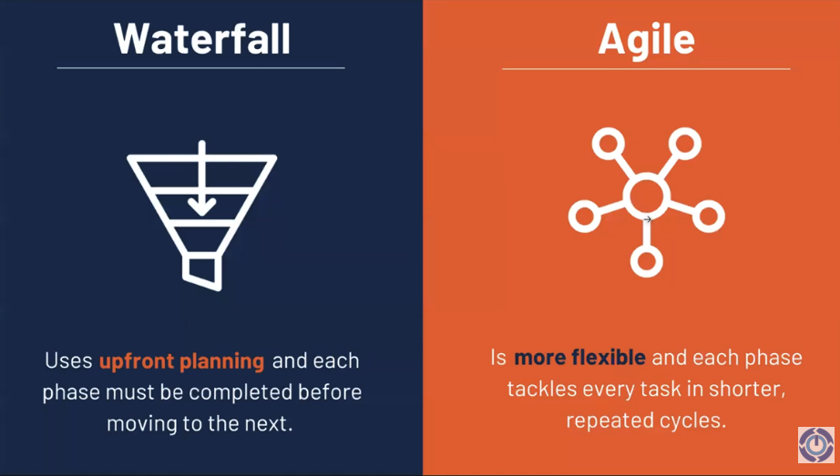
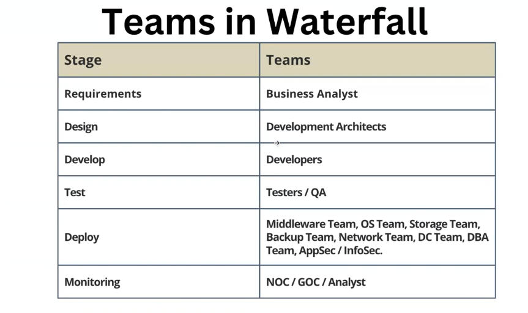
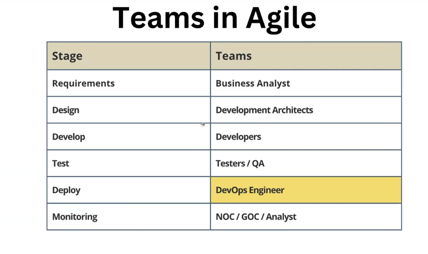
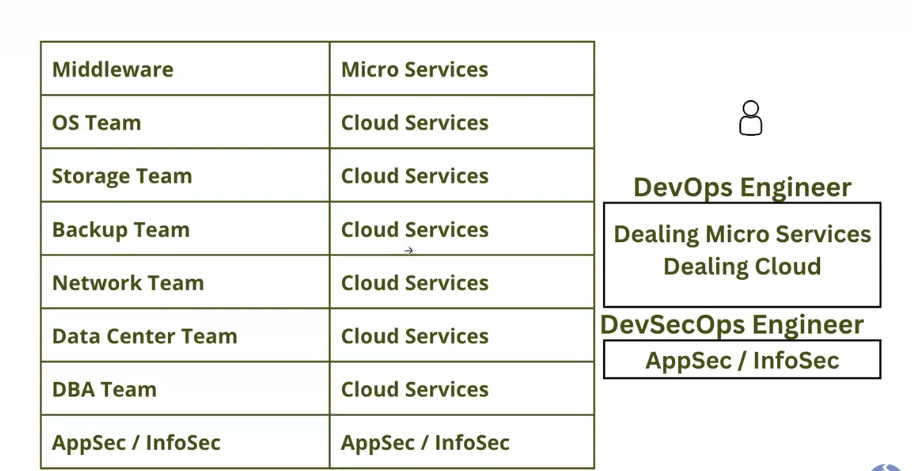
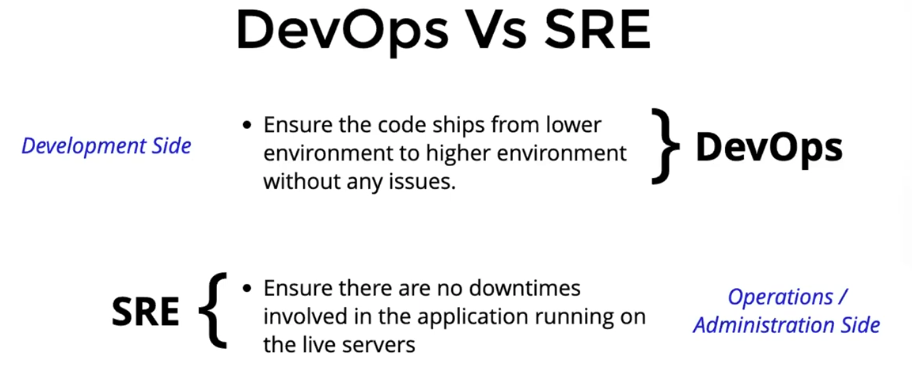

# Architecture Case Studies: Scale & Complexity

## Netflix: Microservices at Scale

How many microservices does netflix have

Netflix operates a massive microservices architecture designed for extreme scalability and resilience.

- **Scale**: The system handles hundreds of millions of users and billions of API calls daily.
- **Service Count**: While exact figures vary, it is estimated to comprise **700+ to over 1000 loosely coupled services**.
- **Functionality**: Each service handles a specific domain, such as user authentication, recommendations, or video processing.
- **Independence**: Teams can deploy features rapidly—often **over 100 times a day**—without impacting the entire system.
- **Key Components**:
  - **Zuul**: API Gateway
  - **Eureka**: Service Discovery
  - **Ribbon**: Load Balancing
- **Evolution**: Transitioned from a monolithic architecture to a distributed system on AWS to support global operations.

## Mercedes-Benz: Kubernetes Transition

How many clusters that mercedes benz have

Mercedes-Benz leverages "clusters" in two distinct contexts, showcasing the versatility of container orchestration and digital interfaces.

### 1. Internal IT Infrastructure

- **Scale**: Runs approximately **900-1000 Kubernetes clusters**.
- **Purpose**: Manages internal software development and IT operations.

### 2. Digital Instrument Clusters

- **Context**: Refers to the digital screens behind the steering wheel in vehicles.
- **Function**: Displays critical driving information.
- **Customization**: Newer models feature dual screens and steering wheel controls for extensive personalization.

> **Note**: The term "cluster" varies by context—ranging from hundreds of tech infrastructure clusters to single or dual display clusters per vehicle.

## Methodology: Agile vs Waterfall

Understanding the shift from traditional to modern development is crucial for DevOps.

### Waterfall Model

- **Process**: A linear, sequential approach (Requirements → Design → Implementation → Verification → Maintenance).
- **Risk**: High risk of discovering critical issues late in the cycle.
- **Flexibility**: Rigid; difficult to accommodate changes once a phase is complete.

In this Waterfall chart, responsibility is strictly segmented.

Requirements & Design (Business Analysts & Architects): These teams define what to build but often lack insight into how it will be operated or deployed. They create the blueprint without knowing if the foundation (infrastructure) can support it efficiently.

Develop (Developers): You write the code based on the specs. In this model, once the code commits are done, your job is often considered "finished." You don't worry about the OS, the storage, or the network.

Test (QA): Testing happens after development is complete. If a bug is found here, it has to go all the way back up the chain, causing massive delays. In DevOps, we "Shift Left" to test during development.

2. The "Deploy" Bottleneck (The Nightmare Scenario)
   The most glaring issue in this image is the Deploy row. Look at the sheer number of teams required just to get software into production:

Middleware Team, OS Team, Storage Team, Backup Team, Network Team, DC Team, DBA Team, AppSec / InfoSec.

### Agile Methodology

- **Process**: An iterative and incremental approach with continuous feedback loops.
- **Benefits**:
  - **Speed**: Faster delivery of functional software.
  - **Flexibility**: Adapts easily to changing requirements.
  - **Collaboration**: Cross-functional teams work together throughout the lifecycle.

> **Comparison**:
> While Waterfall treats software development like a manufacturing line (linear), Agile treats it like a product lab (experimental and iterative).

In a truly mature DevOps environment (often called "DevSecOps" or "Cross-Functional Teams"), these rows shouldn't be separate people.

Requirements/Design: The DevOps engineer should be present here to warn about architectural limits.

Test: Automated testing (CI) should be triggered by Developers, not a separate manual QA phase.

Deploy: Developers should be able to deploy to Dev/Staging environments themselves (Self-Service) using pipelines built by the DevOps Engineer.

## Devops Engineering

DevOps Engineering is the practice of applying engineering principles to DevOps to improve the delivery of software.

1. The "Physical" Roles $\rightarrow$ The Cloud ProviderIn the old "Data Center Team" model, humans had to physically rack servers, wire cables, and manage cooling.Old Way: You open a ticket to the "DC Team" to install a new server rack.DevOps Way: You use AWS, Azure, or Google Cloud. The Cloud Provider hires the people to manage the hardware. You just make an API call (or click a button).Result: The Data Center Team role is outsourced to the Cloud Provider.
2. The "Infrastructure" Roles $\rightarrow$ Infrastructure as Code (IaC)This is where your CKA study becomes relevant. The manual work of configuring networks and storage is now just code (YAML or HCL).
3. The "Middleware" Role $\rightarrow$ Kubernetes & MicroservicesOld Way: The "Middleware Team" was responsible for installing WebLogic, Tomcat, or IIS on servers and keeping them running.DevOps Way: This is native to Kubernetes. The developer packages the app with its own runtime (Docker image). Kubernetes handles the "keeping it running" part (Self-healing pods).4. The "AppSec" Role $\rightarrow$ DevSecOps (Shift Left)Your image rightly separates "AppSec/InfoSec" or labels it DevSecOps.Old Way: Security audits happened at the end (before release).DevOps Way: Security is automated into the pipeline.Static Analysis: Tools scan your code for passwords/vulnerabilities every time you commit.Image Scanning: Tools check your Docker images for known viruses before they ever reach production.

### Devops Vs SRE

### Devops Roles

1. Ensure the code ships from lower environments to higher environments without any issues.
2. Ensure there are no downtime involved in the application running on the production environment.

Tools we have to learn as Devops Engineer

# DevOps Roadmap: Must-Have Tools (In-Depth Guide)

Based on the [roadmap.sh/devops](https://roadmap.sh/devops) guide, these are the industry-standard "must-have" tools for building a robust DevOps pipeline.

---

## 1. Programming Language

**Tool:** **Python** (or Go)

### What it is

Python is a high-level, interpreted scripting language known for its readability and massive ecosystem of libraries. In the DevOps world, it serves as the primary "glue" code.

### Why we use it

- **Automation:** We use Python to write scripts that automate manual tasks (e.g., cleaning up logs, backing up databases, parsing JSON output from APIs).
- **Infrastructure Interaction:** Most DevOps tools (like Ansible) and Cloud SDKs (like AWS Boto3) have first-class Python support, allowing us to control infrastructure programmatically.
- **Versatility:** Unlike Bash (which is great for simple shell tasks), Python can handle complex logic, data structures, and API calls, making it essential for building custom tooling.

---

## 2. Operating System

**Tool:** **Linux** (specifically **Ubuntu** or Debian)

### What it is

Linux is an open-source operating system that powers the vast majority of the world's servers. Ubuntu is a popular, user-friendly distribution of Linux.

### Why we use it

- **Stability & Security:** Linux is architected for multi-user, highly secure server environments. It doesn't force updates or restart unexpectedly like consumer OSs.
- **The Native Home of DevOps:** Tools like Docker, Kubernetes, and Git were built _on_ Linux _for_ Linux. Running them here ensures you are fighting strictly with the tool, not OS compatibility issues.
- **CLI Efficiency:** The Linux terminal (Bash/Zsh) provides powerful text manipulation tools (`grep`, `sed`, `awk`) that allow DevOps engineers to debug and manage systems efficiently.

---

## 3. Version Control System (VCS)

**Tool:** **Git** (hosted on **GitHub**)

### What it is

Git is a distributed version control system that tracks changes in source code. GitHub is the cloud platform that hosts these Git repositories.

### Why we use it

- **Source of Truth:** In DevOps, everything is code (Infrastructure as Code, Pipelines as Code). Git provides the history of _who_ changed _what_ and _when_.
- **Collaboration:** It allows multiple engineers to work on the same infrastructure or application code simultaneously without overwriting each other's work via branching and merging.
- **Triggering Automation:** GitHub is the trigger for modern DevOps. Pushing code to a repository is what automatically kicks off CI/CD pipelines (testing, building, and deploying).

---

## 4. Containerization

**Tool:** **Docker**

### What it is

Docker is a platform that packages an application and all its dependencies (libraries, runtime, settings) into a single lightweight unit called a "container."

### Why we use it

- **"It works on my machine":** Docker eliminates dependency hell. If it runs in a Docker container on your laptop, it will run exactly the same way on the production server.
- **Isolation:** You can run a Python 2 app and a Python 3 app on the same server without their libraries conflicting, as they exist in separate containers.
- **Speed:** Containers start in milliseconds, whereas traditional Virtual Machines (VMs) take minutes to boot. This is critical for auto-scaling.

---

## 5. Cloud Provider

**Tool:** **AWS** (Amazon Web Services)

### What it is

AWS is a cloud computing platform that provides on-demand computing resources (servers, databases, storage) over the internet.

### Why we use it

- **Scalability:** We stop buying physical servers. With AWS, we can spin up 1,000 servers for a busy hour and shut them down immediately after, paying only for what we use.
- **Managed Services:** Instead of manually installing and patching a database, we use AWS RDS. Instead of managing hard drives, we use AWS S3. This offloads maintenance work to Amazon.
- **Standardization:** It is the market leader. Learning AWS patterns (VPCs, IAM, EC2) usually translates well to other clouds like Azure or Google Cloud.

---

## 6. Infrastructure as Code (IaC)

**Tool:** **Terraform**

### What it is

Terraform is a tool that lets you define your cloud infrastructure (servers, networks, load balancers) in text files (code) rather than clicking buttons in a web console.

### Why we use it

- **Reproducibility:** If your production environment crashes, you can run `terraform apply` to rebuild the exact same infrastructure in a new region in minutes.
- **Version Control for Infrastructure:** You can review changes to infrastructure just like code. "Why did the firewall port open?" -> Check the Git commit history for the Terraform file.
- **Cloud Agnostic:** While the code differs slightly, Terraform works with AWS, Azure, Google Cloud, and even on-premise VMWare, providing a unified workflow.

---

## 7. CI/CD (Continuous Integration/Deployment)

**Tool:** **GitHub Actions** (or Jenkins)

### What it is

A platform that automates the software lifecycle. It listens for code changes and automatically runs tests, builds artifacts (like Docker images), and deploys them to servers.

### Why we use it

- **Speed & Consistency:** Humans make mistakes when deploying manually. Pipelines do it the exact same way every time, removing "fat finger" errors.
- **Immediate Feedback:** If a developer breaks the code, the CI tool runs tests and alerts them immediately, preventing bugs from reaching production.
- **Zero-Downtime Deployment:** Advanced pipelines can deploy new versions of an app alongside old ones and switch traffic over gradually (Blue/Green deployment) to ensure users are never impacted.

---

## 8. Container Orchestration

**Tool:** **Kubernetes**

### What it is

While Docker creates the containers, Kubernetes is the "captain" that manages them. It automates deployment, scaling, and management of containerized applications across a cluster of machines.

### Why we use it

- **Self-Healing:** If a container crashes, Kubernetes restarts it. If a server dies, Kubernetes moves the containers to a healthy server.
- **Auto-Scaling:** If traffic spikes, Kubernetes detects the load and automatically spins up more containers to handle it, then removes them when traffic drops.
- **Service Discovery:** It handles the complex networking of finding where your "User Service" is running so your "Auth Service" can talk to it, even as they move between servers.

---

## 9. Monitoring & Observability

**Tools:** **Prometheus** (Metrics) & **Grafana** (Visualization)

### What they are

- **Prometheus** scrapes metrics (CPU usage, memory, request latency) from your servers and applications and stores them in a time-series database.
- **Grafana** takes that data and turns it into beautiful, understandable dashboards.

### Why we use them

- **Proactive Alerting:** We don't want users to tell us the site is down. We set alerts (e.g., "If error rate > 1%") so we know _before_ customers complain.
- **Capacity Planning:** By looking at historical data in Grafana, we can see trends (e.g., "RAM usage grows 10% every week") and upgrade infrastructure before it crashes.
- **Debugging:** When things run slowly, we look at the metrics to see exactly which component (Database? Network? CPU?) is the bottleneck.
