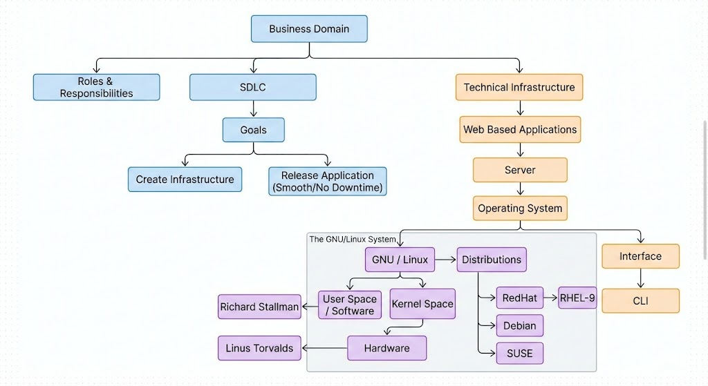

# SDLC



# Linux Basics

`docker run --pull always --entrypoint bash -it rkalluru/debug:centos91`

Command line Syntaxes.

In terminal the first argument we give to execute is a command.
For example:

```sh
uname
# linux
uname -a
uname --all
# Linux 85341026fd9a 6.8.0-51-generic #52-Ubuntu SMP PREEMPT_DYNAMIC Thu Dec 5 13:09:44 UTC 2024 x86_64 x86_64 x86_64 GNU/Linux
```

### ls

The `ls` command (short for "list") is used to list the contents of a directory. By default, it lists the files and subdirectories in the current working directory.

Common options:

- `-l` (long format): Displays detailed information about files and directories, including permissions, owner, group, size, and modification date.
- `-a` (all): Lists all entries, including hidden files (those starting with a `.`).
- `-h` (human-readable): Used with `-l`, displays file sizes in human-readable formats (e.g., K, M, G).
- `-R` (recursive): Lists the contents of directories and their subdirectories recursively.
- `-t` (time sort): Sorts the list by modification time, with the newest files first.
- `-r` (reverse): Reverses the order of the sort.

For example:

```sh
ls -l
# total 16
# drwxr-xr-x. 2 root root 4096 Dec 10 10:00 dir1
# -rw-r--r--. 1 root root   12 Dec 10 10:05 file1.txt

ls -lh
# total 16K
# drwxr-xr-x. 2 root root 4.0K Dec 10 10:00 dir1
# -rw-r--r--. 1 root root   12 Dec 10 10:05 file1.txt

ls -a
# . .. .hidden_file dir1 file1.txt

ls -R
# .:
# dir1  file1.txt
#
# ./dir1:
# subfile.txt
```

```sh
ls

# anaconda-post-addons.log boot dev etc home lib lib64 media mnt opt proc root run sbin srv sys tmp usr var

ls -d /boot

# /boot
```

### Semicolon (`;`)

The semicolon (`;`) is a command separator. It allows you to execute multiple commands sequentially on a single line. Each command is executed one after the other, regardless of whether the previous command succeeded or failed.

For example:

````sh
ls ; uname
# anaconda-post-addons.log boot dev etc home lib lib64 media mnt opt proc root run sbin srv sys tmp usr var
# Linux
```-->

### Logical AND (`&&`)

The logical AND operator (`&&`) allows you to execute multiple commands conditionally. The command to the right of `&&` will only execute if the command to the left of `&&` exits with a zero (success) status. If the first command fails (non-zero exit status), the second command is not executed.

For example:

```sh
ls && uname
# anaconda-post-addons.log boot dev etc home lib lib64 media mnt opt proc root run sbin srv sys tmp usr var
# Linux

# Example of conditional execution:
mkdir mydir && cd mydir && pwd
# /path/to/mydir
````

### Logical OR (`||`)

The logical OR operator (`||`) also allows for conditional command execution. The command to the right of `||` will only execute if the command to the left of `||` exits with a non-zero (failure) status. If the first command succeeds (zero exit status), the second command is not executed.

For example:

```sh
# This will execute uname only if `non_existent_command` fails
non_existent_command || uname
# bash: non_existent_command: command not found
# Linux

# This will not execute `echo "Failed to create directory"` because `mkdir` succeeds
mkdir new_dir || echo "Failed to create directory"
# (new_dir is created)

# This will execute `echo "Failed to create directory"` because `mkdir /root/new_dir` fails without privileges
mkdir /root/new_dir || echo "Failed to create directory"
# mkdir: cannot create directory ‘/root/new_dir’: Permission denied
# Failed to create directory
```

### Linux Directory Structure

The Linux file system is organized in a hierarchical structure, starting from the root directory (`/`). This structure is standardized by the Filesystem Hierarchy Standard (FHS), which defines the purpose of each directory. Understanding this structure is crucial for navigating and managing files effectively in a Linux environment.
[Linux Directory Structure Explained](https://www.howtogeek.com/117435/htg-explains-the-linux-directory-structure-explained/)
Here are some of the most common and important top-level directories:

- `/` (Root): The top-most directory in the file system hierarchy. All other directories and files are located under this directory.
- `/bin`: (Binary) Contains essential user command binaries that are available to all users, such as `ls`, `cp`, `mv`, `rm`.
- `/sbin`: (System Binary) Contains essential system administration binaries, typically used by the root user, such as `fdisk`, `ifconfig`, `mount`.
- `/etc`: (Etc) Contains system-wide configuration files and scripts.
- `/dev`: (Devices) Contains device files, which represent hardware devices (e.g., `/dev/sda` for a hard drive, `/dev/tty1` for a terminal).
- `/proc`: (Processes) A virtual filesystem providing information about running processes and kernel parameters.
- `/var`: (Variable) Contains variable data files, such as log files (`/var/log`), mail queues (`/var/mail`), and temporary files (`/var/tmp`).
- `/tmp`: (Temporary) Stores temporary files created by users and applications. Contents are often cleared on reboot.
- `/usr`: (Unix System Resources) Contains user programs, libraries, documentation, and other read-only data. It's a major branch of the file system.
  - `/usr/bin`: Non-essential user command binaries.
  - `/usr/sbin`: Non-essential system administration binaries.
  - `/usr/local`: For locally installed software that is not part of the distribution.
- `/home`: Contains the personal directories for regular users. Each user typically has a subdirectory here (e.g., `/home/username`).
- `/root`: The home directory for the root user.
- `/boot`: Contains files needed to boot the operating system, including the Linux kernel and GRUB bootloader files.
- `/lib` and `/lib64`: (Libraries) Contains essential shared libraries needed by the binaries in `/bin` and `/sbin`. `/lib64` is for 64-bit systems.
- `/opt`: (Optional) Used for installing optional or third-party software packages that are not part of the standard system.
- `/mnt`: (Mount) A temporary mount point for mounting removable media (e.g., USB drives, CD-ROMs).
- `/media`: (Media) Another mount point for removable media, often managed automatically by the desktop environment.
- `/srv`: (Service) Contains site-specific data served by the system (e.g., data for web servers, FTP servers).

## Navigate to Directories

- `cd /bin`: Changes the current directory to `/bin`.
- `pwd`: (Print Working Directory) Displays the full path of the current directory.
- `cd ..`: Changes the current directory to the parent directory of the current one.

## Create Files & Directories

- `touch <filename>`: Creates a new empty file or updates the access and modification times of an existing file.
  - `touch my_file.txt`: Creates an empty file named `my_file.txt`.
  - `touch file1.txt file2.txt`: Creates multiple empty files.
- `mkdir <directory_name>`: Creates a new directory (folder).
  - `mkdir my_directory`: Creates a directory named `my_directory`.
  - `mkdir -p parent_dir/child_dir`: Creates a directory and any necessary parent directories that don't already exist.
  - `mkdir dir1 dir2`: Creates multiple directories.

# Remove Files & Directories

- `rm <filename>`: Removes (deletes) files.
  - `rm my_file.txt`: Deletes `my_file.txt`.
  - `rm file1.txt file2.txt`: Deletes multiple files.
- `rm -f <filename>`: Forcefully removes files without prompting for confirmation, even if they are write-protected.
  - `rm -f important_file.txt`: Deletes `important_file.txt` without confirmation.
- `unlink <filename>`: Another command to remove a single file. It's similar to `rm` but only works for one file at a time and doesn't have as many options.
  - `unlink old_link.txt`: Deletes `old_link.txt`.
- `rmdir <directory_name>`: Removes an empty directory. It will fail if the directory contains any files or subdirectories.
  - `mkdir empty_dir`
  - `rmdir empty_dir`: Deletes `empty_dir` (only if it's empty).
- `rm -r <directory_name>`: Recursively removes a directory and its contents (files and subdirectories). It will prompt for confirmation for each item by default.
  - `mkdir demo1`
  - `touch demo1/new.txt`
  - `rm -r demo1`: Deletes `demo1` and its contents after prompting.
- `rm -rf <directory_name>`: Forcefully and recursively removes a directory and all its contents without prompting for confirmation. This is a very powerful and dangerous command, use with extreme caution.
  - `mkdir demo2`
  - `touch demo2/file_to_delete.txt`
  - `rm -rf demo2`: Deletes `demo2` and `file_to_delete.txt` immediately without confirmation.

**Note:** Once files or directories are removed using `rm` (especially with `-f` or `-rf`), there is generally no way to retrieve them. Always double-check your command before executing `rm -rf`.

# `unlink` Command

- `unlink <filename>`: Removes a single file. This command is a simpler alternative to `rm` for deleting individual files. It directly calls the `unlink()` system function.
  - `unlink my_single_file.txt`: Deletes `my_single_file.txt`.
  - **Note:** Unlike `rm`, the `unlink` command typically does not support any flags or options (e.g., `-f` for force, `-r` for recursive) as its purpose is solely to remove a single file by its name. It will not prompt for confirmation.

# Copying Files & Directories

In Linux, the primary command for copying files and directories is `cp`. While `rsync` is another powerful utility often used for more advanced synchronization tasks, `cp` is generally preferred for straightforward copying operations.

## `cp` Command for Files

The `cp` command is used to copy files from one location to another.

**Syntax:**
`cp [OPTIONS] <source-file> <destination>`

- `<source-file>`: The path to the file you want to copy.
- `<destination>`: The path where you want to copy the file. This can be a new filename or an existing directory.

**Behavior:**

- If `<destination>` is a directory, the `source-file` will be copied into that directory with its original name.
- If `<destination>` is a file path that doesn't exist, the `source-file` will be copied and renamed to `<destination>`.
- If `<destination>` is an existing file, `cp` will overwrite it (unless options like `-i` are used).

**Example 1: Copying a file to a new file name in the same directory**

```bash
cp notes.txt pages.txt
```

This command copies the content of `notes.txt` to a new file named `pages.txt` in the current directory.

**Verification:**
You can use the `ls` command to verify that the file has been copied.

```bash
ls
```

This will list `notes.txt` and `pages.txt` (among other files) if the copy was successful.

**Example 2: Copying a file to a different directory**

```bash
cp document.pdf /home/user/documents/
```

This copies `document.pdf` from the current directory into the `/home/user/documents/` directory.

## `cp -r` Command for Directories

To copy entire directories and their contents (including subdirectories and files), you must use the `-r` (recursive) option with the `cp` command.

**Syntax:**
`cp -r [OPTIONS] <source-directory> <destination>`

- `<source-directory>`: The path to the directory you want to copy.
- `<destination>`: The path where you want to copy the directory. This can be a new directory name or an existing directory.

**Behavior:**

- If `<destination>` is an existing directory, `source-directory` will be copied _into_ it. For example, `cp -r dir1 dir2` would result in `dir2/dir1`.
- If `<destination>` does not exist, `source-directory` will be copied and named as `<destination>`.

**Example:**
Let's create a sample directory with a file inside it:

```bash
mkdir demo
touch demo/new.txt
```

Now, let's copy this `demo` directory to the `/tmp` location:

```bash
cp -r demo /tmp
```

This command copies the `demo` directory and its contents (`new.txt`) into the `/tmp` directory.

**Verification:**
You can verify the copy operation by listing the contents of the destination directory:

```bash
ls /tmp
# Expected output might include 'demo'
ls /tmp/demo
# Expected output: 'new.txt'
```

## Useful `cp` Options

Beyond `-r` for recursive copies, `cp` offers several other useful options:

- `-i` (interactive): Prompts you before overwriting an existing file. This is a good safety measure to prevent accidental data loss.
  ```bash
  cp -i file1.txt file2.txt
  # cp: overwrite 'file2.txt'? y
  ```
- `-u` (update): Copies only when the source file is newer than the destination file or when the destination file is missing. Useful for updating files without overwriting everything.
  ```bash
  cp -u old_version.txt new_location/
  ```
- `-v` (verbose): Explains what is being done. It prints the name of each file as it is copied.
  ```bash
  cp -v file1.txt /tmp/
  # 'file1.txt' -> '/tmp/file1.txt'
  ```
- `-p` (preserve): Preserves the original file attributes, including mode (permissions), ownership, and timestamps.
  ```bash
  cp -p confidential.data /backup/
  ```
- `-a` (archive): This is a combination of other options (`-dR --preserve=all`). It's commonly used for backups as it attempts to preserve as much of the original file characteristics as possible (permissions, timestamps, ownership, links, etc.) and copies directories recursively.
  ```bash
  cp -a project_folder /mnt/backup_drive/
  ```
- `-n` (no clobber): Prevents overwriting existing files. If a file already exists at the destination, `cp` will not copy the source file.
  ```bash
  cp -n important.txt /data/
  ```

## `rsync` as an Alternative

While `cp` is excellent for most copying tasks, `rsync` is a more advanced tool often used for:

- Synchronizing files and directories between two locations (local or remote).
- Efficiently copying large files or many files, as it only transfers the differences between source and destination.
- More robust error handling and progress reporting.

For general, single-shot copy operations, `cp` remains the go-to command due to its simplicity and ubiquity.
