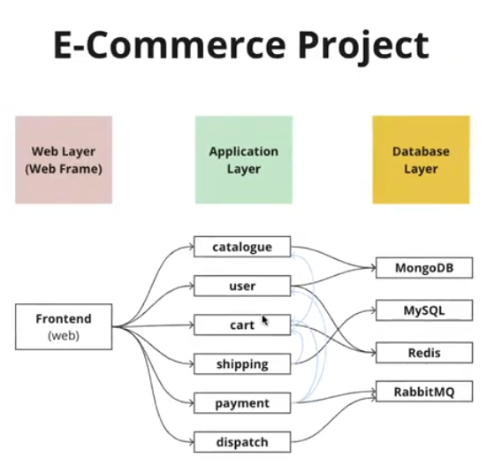

# E-Commerce RoboShop Project

RoboShop is a microservices-based e-commerce application demonstrating a modern 3-tier architecture with multiple independent services communicating through APIs and message queues.

1. Web Layer (Presentation Tier)

Frontend (Web) - React/Angular based user interface
Serves the customer-facing application
Handles user interactions and API calls to backend services

2. Application Layer (Business Logic Tier)

Multiple microservices handling specific business domains
RESTful APIs for service communication
Independent deployment and scaling per service

3. Database Layer (Data Tier)

Multiple database technologies optimized for specific use cases
Caching layer for performance
Message queue for asynchronous operations

## Service Architecture & Connections

MicroServices

- impact of overall application down time is less
- Horizontal Scalling is Possible
- MicroServices BRINGS FLEXABILITY TO CHOOSE DIFFERENT PROGRAMMING LANGUAGES.
- MicroServices communicate each other over the network
- MicroServices can help poly cloud apps.

## Project Standards that we use now

- We are going to use allow-all security group for this project.
- A single individual server for each and every micro service.
- We use <strong>private IP addresses</strong> for internal communication.
- Software version requirements are defined by developers and must be verified prior to installation.
